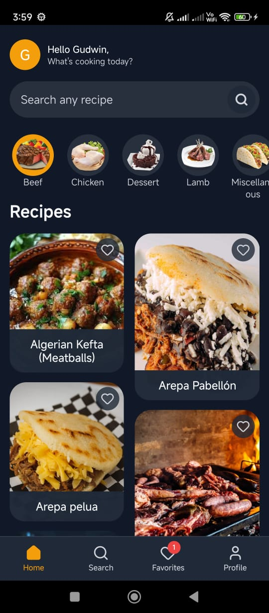
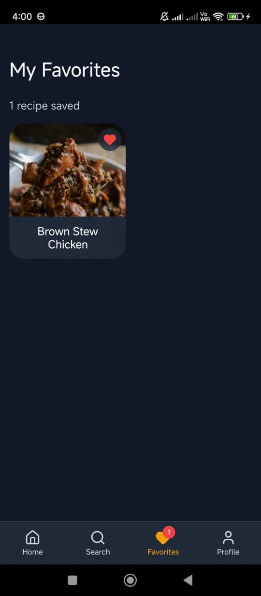
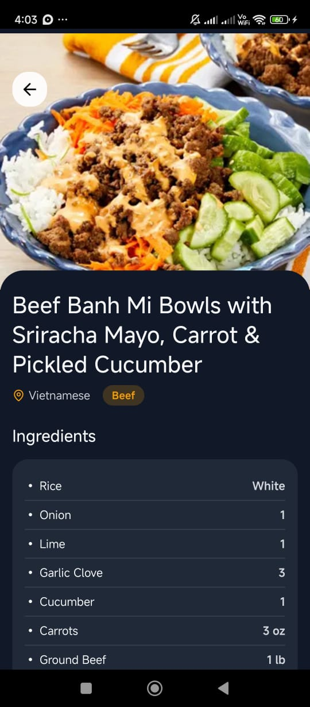
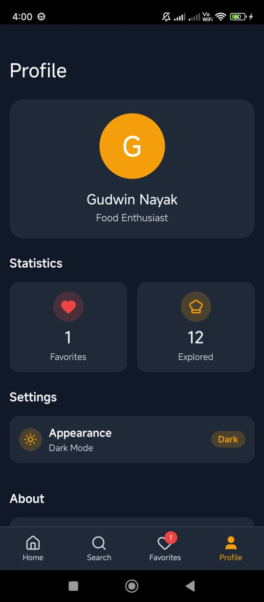

# Mealify App 🍽️

A beautiful and feature-rich recipe discovery application built with React Native.

## 📱 Features

- **Discover Recipes**: Browse thousands of recipes from various categories (Beef, Chicken, Dessert, etc.).
- **Search**: Real-time search functionality with debouncing to find your favorite meals instantly.
- **Recipe Details**: View detailed ingredients, measurements, and step-by-step instructions.
- **Favorites**: Save your favorite recipes for quick access later.
- **Profile**: Track your culinary journey with statistics and manage app settings.
- **Dark Mode**: Fully supported dark theme for comfortable night browsing.
- **Animations**: Smooth, staggered animations for a premium user experience.

## 📸 Screenshots

Welcome Screen| Home Screen | Search Screen | Favorites Screen | Meal Detail | Profile Screen |
|:---:|:---:|:---:|:---:|:---:|:---:|
|  |  |  |  |  | 


## 🛠️ Setup Instructions

Follow these steps to run the project locally:

### Prerequisites
- Node.js (v18 or newer)
- Java Development Kit (JDK 17)
- Android Studio (for Android) or Xcode (for iOS)

### Installation

1. **Clone the repository**
   ```bash
   git clone https://github.com/yourusername/mealify-app.git
   cd mealify-app
   ```

2. **Install dependencies**
   ```bash
   npm install
   # or
   yarn install
   ```

3. **Start the Metro Server**
   ```bash
   npm start
   # or
   yarn start
   ```

4. **Run on Android**
   ```bash
   npm run android
   # or
   yarn android
   ```

5. **Run on iOS** (Mac only)
   ```bash
   cd ios && pod install && cd ..
   npm run ios
   # or
   yarn ios
   ```

## 🌟 Bonus Features Implemented

- **Advanced Search**: Implemented debounced search to optimize API calls and improve performance.
- **Persistent Favorites**: Uses `AsyncStorage` to persist favorite recipes across app restarts.
- **Image Caching**: Custom caching solution for optimized image loading.
- **Skeleton Loading**: Smooth loading states with animated skeletons for categories and recipes to enhance perceived performance.
- **Theme System**: Robust context-based theme system supporting light and dark modes.
- **Responsive Design**: Uses `react-native-responsive-screen` for perfect layout on all device sizes.
- **Beautiful UI/UX**: Glassmorphism effects, staggered animations, and clean typography.

## 📝 Submission Details

- **GitHub Repository**: [Link to your repo](https://github.com/GudwinNayak-9284/mealify-app.git)

---

Built with ❤️ using React Native, TypeScript, and NativeWind.
